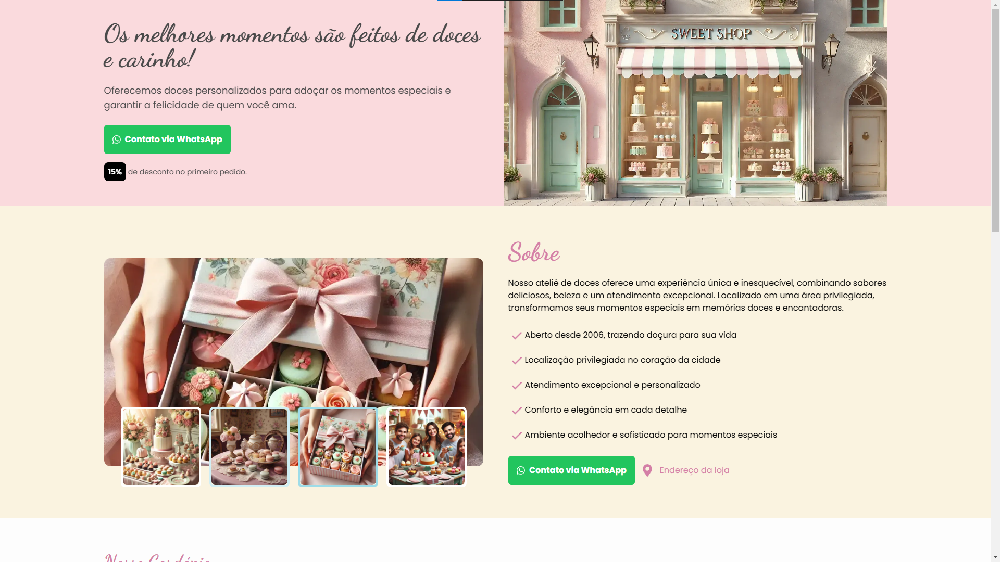

#  **Landing Page para Docerias - SweetShop**

---

---

Este é um modelo de **Landing Page** feito sob medida para **docerias**, desenvolvido com foco em design, funcionalidade e performance. A aplicação é completamente **responsiva**, segue o conceito **mobile-first** e apresenta **SEO otimizado** para garantir uma experiência de usuário excepcional.

---

##  **Estrutura**

1. **Hero (Apresentação):**
   - Banner de boas-vindas destacando a doceria.  
   - Texto impactante para chamar a atenção do usuário.

2. **Sobre:**
   - Pequena descrição sobre a doceria.  
   - Um **carousel elegante** exibindo imagens relacionadas.

3. **Informações da Loja:**
   - Destaques sobre a loja, como história, especialidades e diferenciais.  
   - Botão **CTA** (Call to Action) que direciona o usuário para o atendimento (ex.: WhatsApp ou outro canal).

4. **Cardápio:**
   - **Cards em formato de carousel** apresentando os produtos disponíveis.  
   - Foco em design limpo e organizado.

5. **Comentários de Clientes:**
   - Seção dedicada a **depoimentos de clientes** satisfeitos, com um formato visual atraente e funcional.

---

##  **Tecnologias Utilizadas**

- **[React](https://reactjs.org/):** Biblioteca JavaScript para construção de interfaces.  
- **[Next.js](https://nextjs.org/):** Framework para renderização SSR e SSG.  
- **[Tailwind CSS](https://tailwindcss.com/):** Framework CSS utilitário para estilização rápida e eficiente.  
- **[Shadcn/ui](https://shadcn.dev/):** Componentes estilizados para React.  
- **[Amble Carousel React](https://www.npmjs.com/package/amble-carousel-react):** Biblioteca para carousels elegantes e personalizados.  
- **Imagens geradas por IA:** Elementos visuais criados com ferramentas de inteligência artificial.

